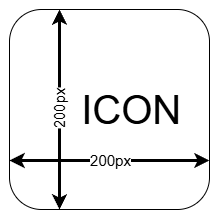
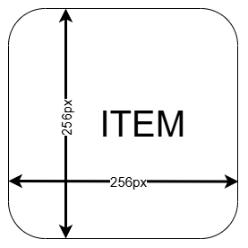
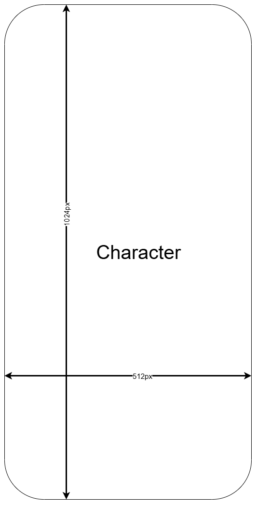
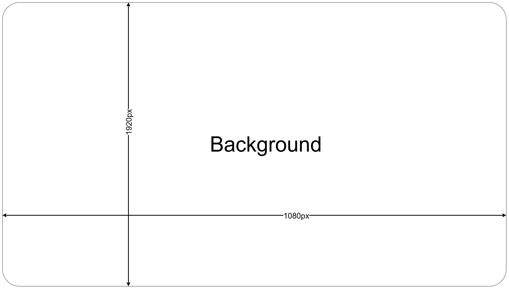
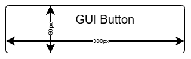

# Creating AI Assets for Cybergame Modules

This guide explains how to create visual assets for your Cybergame module using AI image-generation tools. The goal is simple: produce consistent, clean images that load correctly in the template.

### Planning your Assets

Group your assets into the expected template asset categories under `game/extra/assets`:

- `backgrounds/`
- `characters/`
- `gui/`
- `items/`
- `pages/`

For each image asset decide the following:

- required size/aspect ratio
- background type (solid / transparent)
- chosen visual style

### Keep a Simple, Consistent Style

Choose a consistent visual style and palette before bulk-generating assets. Use 2–4 reference images or keywords. Pick one visual style and stick to it (e.g. “hand-painted soft”, “flat-vector 2px lines”, “light cartoon”). Use the same palette or mood words in every prompt.

### File Formats & Recommended Sizes

- `icons`: 200px square

  

- `items`: 256–512px square

  

- `characters`: 1024–2048px (square or portrait)

  

- `backgrounds`: 1920×1080 or 3840×2160

  

- `GUI buttons`: design at 2× size for crispness

  

**PNG** is recommended for most assets. Use transparent backgrounds for characters, icons, and GUI elements.

### Creating a Good Prompt Structure

A good image generation prompt includes:

- `what it is`
- `style`
- `lighting/mood`
- `background (transparent/solid)`
- `resolution`

#### Example character:

> Hand-painted character portrait of a young cybersecurity engineer wearing a hoodie; three-quarter view; soft rim light; transparent background; 2048x2048 PNG; no text or watermarks.

#### Example background:

> Office lab environment at dusk, monitors and cables, warm/purple lighting, uncluttered center area; 16:9; 3840x2160 PNG.

#### Example item icon:

> Clean icon of a USB key with neon-blue LED, simple silhouette, transparent background, 512x512 PNG.

## Quick Workflow (End-to-End)

1. List needed assets by type.
2. Pick ONE visual style and color vibe.
3. Generate prompts with ChatGPT/Gemini.
4. Render images in your preferred image generator.
5. Remove backgrounds if needed.
6. Export and name files properly.
7. Drop them in `game/extra/assets/.`
8. Preview in the local server (incognito tab recommended).

### Online Image Generators

These tools run directly in the browser and use open-source or directly available models.

- [HuggingFace Spaces](https://huggingface.co/spaces): Large collection of Stable Diffusion and SDXL models you can run instantly in-browser.
  Good for backgrounds, icons, characters.

- [Mage.space](https://www.mage.space): Free SDXL / Stable Diffusion generator, unlimited usage with login. Fast, clean UI, supports transparent PNG.

- [Tensor.art](https://tensor.art): Free, browser-based diffusion platform with many community models.
  Great for stylized character portraits or icons.

- [Pollinations.ai](https://pollinations.ai): Simple free API + web interface for generating images using open models. Useful for quick drafts or placeholders.

- [Civitai “Generate”](https://civitai.com/generate): Runs community models directly in-browser (still experimental). Good for style-specific looks.

- [Bing Image Creator](https://www.bing.com/images/create): AI-powered image generation integrated in-browser. Works well for quick ideas with unlimited tries. 
