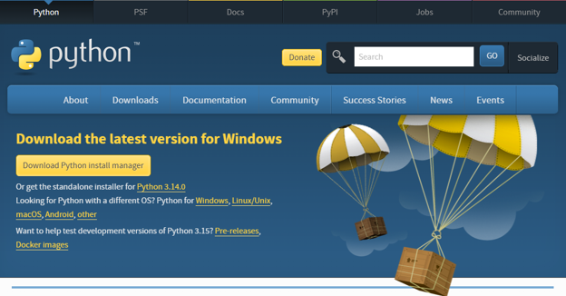
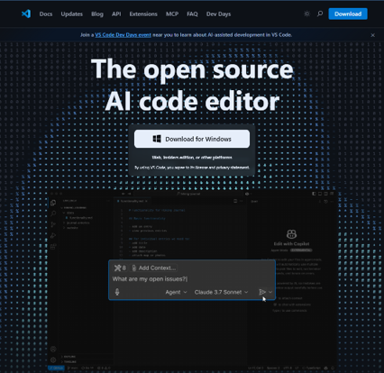
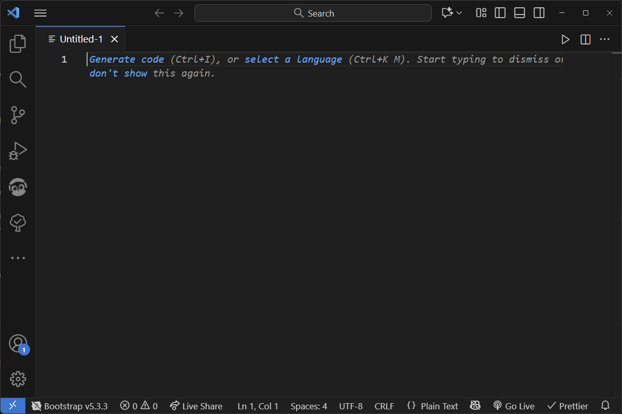

# Prerequisites for Cybergame Modules

This guide explains how to set up the required prerequisites for developing Cybergame Modules. You only need a small set of tools to develop and run Cybergame modules locally. This document lists the essential prerequisites and how to install them.

## Python Language 🐍

Cybergame modules use Python-based tooling for building, packaging, and validating game bundles.

1. Head to the [official Python website](https://www.python.org/downloads/) and download Python ≥3.10:



2. During installation, be sure to enable **Add to PATH**
3. Verify that Python is installed and check its version:

```bash
python --version

> Output:
Python 3.12.9
```

4. Verify that pip is installed and check its version:

```bash
python -m pip --version

> Output:
pip 24.3.1 from C:\Program Files\Python312\Lib\site-packages\pip (python 3.12)
```

## Visual Studio Code IDE

Use a code editor to work with the YAML-based module format and the auxiliary Python scripts.
VS Code is the recommended editor.

1. Install VS Code from the [official site](https://code.visualstudio.com/)



2. Open your Cybergame module project folder as the working directory.



3. You are all set, `happy hacking`!
